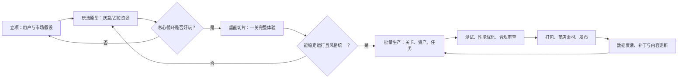

# 使用 AI 制作 2D 或 3D 游戏的工作流程

**作者：Manus AI**  
**适用对象：** 独立开发者、小型工作室、希望把 AI 纳入既有游戏管线的策划、程序与美术人员。  
**核心原则：** AI 应用于加速“发散、草稿、重复性劳动与验证”，而人应对“玩法取舍、风格一致性、可玩性、合规与最终验收”负责。

> **目标不是一次性让 AI 生成一款完整游戏，而是用可验证的短循环，持续将“可玩的最小版本”迭代为可发布产品。**

## 1. 先选择正确的项目形态

对于首次采用 AI 制作的团队，建议从 **单一核心机制、单平台、10–30 分钟可体验内容** 的项目开始。例如，2D 可选择俯视角生存、横版动作、卡牌或解谜；3D 可选择第一人称解谜、短流程探索或小型竞速。不要在第一个版本同时追求开放世界、多人联机、复杂剧情与大量角色动画。

| 维度 | 2D 项目 | 3D 项目 | 选择建议 |
|---|---|---|---|
| 典型优势 | 资产制作快、镜头与性能风险低、AI 图像更易修整 | 沉浸感强、空间玩法丰富、适合探索与物理互动 | 若目标是快速验证玩法，优先 2D；若空间感就是玩法核心，再选 3D |
| AI 重点产物 | 概念图、精灵图、图块、UI、立绘、音效草案 | 概念图、白模参考、材质、贴图、道具原型、动画参考 | AI 产物先进入“候选素材库”，不要直接进入正式资源库 |
| 主要风险 | 角色帧间不一致、图块接缝、可读性差 | 拓扑与骨骼问题、风格漂移、性能与碰撞复杂度高 | 3D 必须更早建立面数、贴图、骨骼与碰撞预算 |
| 推荐引擎 | Godot、Unity、GameMaker | Unreal Engine、Unity、Godot | 以团队熟悉度、发布平台和插件生态优先，而非仅看 AI 能力 |

## 2. 总体生产闭环



这套流程以 **玩法原型（prototype）→ 垂直切片（vertical slice）→ 批量内容生产** 为三个控制闸门。原型只回答“是否好玩”；垂直切片则必须用接近正式品质的美术、音频、UI 和存档流程，验证“能否做成产品”；只有通过垂直切片后，才值得生成大批量素材和关卡。

## 3. 分阶段 AI 协作流程

| 阶段与产出 | 人负责的决策 | AI 可承担的工作 | 验收标准 |
|---|---|---|---|
| **0. 立项（1–3 天）**：一页项目简报 | 受众、平台、商业模式、边界条件 | 竞品维度表、玩法变体、风险清单、命名候选 | 用一句话能说明玩家“反复做什么、为何有趣” |
| **1. 玩法设计（3–7 天）**：GDD Lite、核心循环 | 最终机制、失败条件、成长节奏 | 机制头脑风暴、数值初稿、任务模板、剧情分支草案 | 3–5 分钟试玩中，玩家无提示理解目标 |
| **2. 灰盒原型（1–3 周）**：可玩 Demo | 代码架构、输入、镜头、手感参数 | 伪代码、脚本初稿、调试工具、测试用例、占位资源 | 核心循环至少连续运行 10 次且无阻断错误 |
| **3. 视觉圣经（2–5 天）**：风格板、资产规范 | 取舍、角色辨识、目标分级 | 概念变体、色板建议、材质/图标/精灵草稿 | 每种资产都有尺寸、命名、色彩、授权来源规范 |
| **4. 垂直切片（2–6 周）**：完整小关卡 | “是否达到发布品质”的判断 | 场景草图、对白、音效方向、代码辅助、QA 清单 | 从启动、游玩、失败、重开到结算全链路完整 |
| **5. 批量生产**：正式内容 | 资产优先级、关卡节奏、版本范围 | 受控批量生成、变体整理、文本本地化草案 | 每个资源均有来源、版本、技术检查与负责人 |
| **6. 测试发布**：候选版本与商店页 | 缺陷优先级、发布节奏、定价与渠道 | 日志归类、回归测试草案、商店文案多版本 | 在目标真机/配置上通过冒烟、性能与发布检查 |

### 3.1 立项：把“想法”压缩成可执行约束

先写一页项目简报，至少包含：目标玩家、目标平台、核心动词、单局时长、独特卖点、视觉关键词、禁止范围和最小可发布内容（MVP）。让 AI 提供十个方向可以，但应由负责人选定 **一个玩法假设**，避免“把 AI 的所有好点子都加进去”。

一个可直接复用的需求模板如下：

```text
你是游戏设计协作者。为以下项目提出 5 个可在两周内做出原型的玩法变体。
项目：{一句话概念}
玩家：{目标用户}
平台与操作：{PC/移动端/手柄等}
必须保留：{核心动词或主题}
禁止加入：{多人、开放世界、抽卡等}
每个变体输出：核心循环、30 秒目标、失败条件、成长变量、实现风险与最小原型范围。
不要编写完整剧情或营销文案。
```

### 3.2 原型：先使用“丑但准确”的资源

原型阶段应使用几何体、色块、免费临时素材或自己绘制的占位图。AI 适合协助生成状态机、交互脚本、数据表、调试菜单和单元测试草案，但必须让代码进入版本控制，并在真实引擎中逐段运行验证。对于 AI 生成代码，建议采用“**小函数、小提交、小验证**”规则：一次只让 AI 修改一个明确功能，并要求说明涉及的文件、输入输出和测试方式。

对于有引擎项目的资源管理，官方文档所描述的通用结构是“导入资源 → 在编辑器中组装内容 → 构建 → 分发 → 必要时更新”；这恰好适合将 AI 输出放在受控的导入与验收环节，而不是让它绕过项目管理直接覆盖正式文件。[1]

### 3.3 美术和音频：生成、清洗、规范化，再导入

AI 视觉生成应从 **风格板** 开始，而不是直接生成数百个角色。先固定色板、轮廓语言、镜头角度、光照、材质、UI 字体和负面约束，然后制作 3–5 个“金标准”样本。之后每次生成必须引用同一套风格说明与样本，并记录提示词、模型、日期、输入参考和使用许可。

| 资产类别 | AI 的合理职责 | 人工/传统工具的必要处理 | 技术验收 |
|---|---|---|---|
| 2D 角色与精灵 | 立绘方向、服装变体、姿态参考 | 重绘关键帧、切图、统一描边与锚点 | 帧尺寸、pivot、命名、碰撞盒、可读性一致 |
| 图块与场景 | 概念、纹理、装饰物草图 | 无缝化、分层、色彩校正、手工关卡组合 | 无接缝、层级明确、碰撞与遮挡正确 |
| 3D 道具与场景 | 概念、基础模型或材质参考 | 清理网格、UV、拓扑、碰撞体、LOD、贴图烘焙 | 面数、贴图规格、法线、材质槽、缩放统一 |
| 角色 3D 资产 | 角色设计、正侧背参考、服装方案 | 人工建模、绑定、权重、动画与表情修正 | 骨架统一、变形合格、动作无穿模 |
| 音乐与音效 | 情绪参考、临时 BGM、事件音效草案 | 混音、响度、循环点、授权核验 | 格式、采样率、循环、音量分组与触发时机 |

**重要约束：** 不要把未审查的生成素材投入商业发布。保存生成记录与原始文件；避免提示词要求复制特定在世艺术家的风格、受版权保护角色、商标或音乐片段；对于人物肖像、第三方素材与语音，确认授权、平台政策和适用法律。若无法证明来源和许可，就把它视为不可发布资产。

### 3.4 3D 的额外门槛

3D 资产比 2D 多出一层“可运行性”要求。一个漂亮的生成模型不等于游戏资产：它还需要正确的尺寸、干净的拓扑、可预测的 UV、合理材质、碰撞体、LOD（细节层级）、骨骼和性能预算。最稳妥的做法是让 AI 负责概念、参考、材质和低保真草模，把角色绑定、关键动作和交互碰撞作为人工验收重点。

## 4. 推荐的项目目录和资产状态

使用统一目录与“资产状态标签”能把 AI 产物从正式资源中隔离出来，降低误用风险。

```text
GameProject/
  docs/                 # 简报、GDD、风格圣经、变更记录
  prompts/              # 可复现的提示词与参考说明
  assets/
    _inbox_ai/          # AI 原始输出：禁止直接被游戏引用
    _review/            # 等待技术、美术、授权审查
    approved/           # 已验收的源文件
    runtime/            # 引擎可直接引用的导入资产
  scenes_or_levels/     # 场景、关卡
  scripts/              # 代码与工具
  tests/                # 自动化和手动测试清单
  builds/               # 不进入版本控制的构建产物
```

每个资源至少应维护以下字段：`asset_id`、类别、用途、负责人、状态、源文件位置、生成/购买来源、许可证或授权凭据、导入规格、最后验证版本。**从 `_inbox_ai` 到 `approved` 必须由人签字或在任务系统中留痕。**

## 5. 质量保障：把“AI 生成”转化为可测试的假设

### 5.1 每日开发循环

每天的有效循环应是：先挑选一个可观察的目标，例如“玩家能在 20 秒内看懂可交互物”；然后让 AI 帮助提出实现或变体；接着在引擎中制作最小改动；最后用试玩、日志或性能数据检验。不要以“生成了多少张图、多少行代码”作为进度指标，而要以“玩家行为是否改善”作为指标。

### 5.2 四层验收清单

| 层级 | 必问问题 | 示例检查 |
|---|---|---|
| 玩法 | 玩家是否理解、选择是否有意义、失败是否公平？ | 盲测 3–5 名目标玩家；记录首次失败原因 |
| 技术 | 是否稳定、可保存、帧率和内存是否达标？ | 冒烟测试、异常日志、目标设备性能采样 |
| 内容 | 文本、镜头、音效、引导是否一致？ | 关卡通关表、文本审校、无障碍检查 |
| 合规 | 使用权、隐私、商标和平台要求是否满足？ | 素材台账、第三方许可、商店问卷与分级材料 |

AI 可以把崩溃日志、玩家反馈和缺陷描述归类为“阻断、严重、一般、体验优化”，并生成回归测试建议；但开发负责人必须复现问题并决定优先级。尤其对涉及存档、付费、账号、隐私和联机的功能，不能仅依赖 AI 审阅。

## 6. 构建、测试与发布

在临近发布时，务必在**打包后的独立版本**测试，而不只是在编辑器内运行。Unreal 的官方说明明确将打包用于生产测试、最终分发和补丁/DLC，并把构建、内容转换优化（cook）、暂存、打包、部署和运行区分为独立步骤。[2] 这意味着“编辑器里能跑”不等于“目标平台上可发布”。

对于跨平台项目，建立 `Debug/Development`、`Test` 与 `Shipping/Release` 的分离版本，且为每个版本记录提交号、资源版本、目标平台和已知问题。Godot 的导出文档也指出，导出预设配置通常可安全提交到版本控制，而包含密码和加密密钥的凭据文件不应随意提交或共享；其命令行导出适合生产中的自动化构建。[3]

发布前至少完成一次“从零安装”测试：在没有编辑器和开发依赖的干净机器或真机上，下载构建包，完成首次启动、设置、完整一局、存档/读取、退出和卸载。若项目采用 Unity，则应将导入设置、预设和平台资源规格作为构建检查的一部分；其资源工作流支持导入、组装、构建、分发和更新，并强调不同平台下资源规格与内存管理的差异。[1]

## 7. 两套可落地的最小流程

### 7.1 两周 2D 原型冲刺

| 时间 | 目标 | AI 使用边界 |
|---|---|---|
| 第 1–2 天 | 项目简报、核心循环、纸面规则 | 生成变体与数值草案；人选定一个方向 |
| 第 3–5 天 | 输入、角色移动、胜负条件 | 代码辅助仅限单一功能；每次提交后运行 |
| 第 6–7 天 | 一张灰盒关卡、最小 UI | AI 图仅作占位，不处理批量美术 |
| 第 8–10 天 | 3 次外部试玩、修正手感 | AI 汇总反馈与提出假设；人决定修改 |
| 第 11–12 天 | 视觉小样、音效、教程 | 用统一风格板生成少量候选资产 |
| 第 13–14 天 | 打包、从零安装、复盘 | AI 生成测试清单和发布说明初稿 |

### 7.2 六周 3D 垂直切片

第一周完成灰盒空间、移动、镜头和交互；第二周锁定一项核心机制并做外部试玩；第三周确定风格圣经、性能预算和资产规范；第四周将一段完整流程接入正式级角色、道具、UI 与音频；第五周进行真机性能、存档、失败流程与可用性测试；第六周只做缺陷修复、构建和发布材料，不再新增机制。3D 项目若在第三周仍未确定角色骨骼、碰撞、面数与贴图规范，应暂停批量资产生成。

## 8. 常见误区与对应修正

| 误区 | 后果 | 修正方式 |
|---|---|---|
| 先生成几百份资产再做玩法 | 资产与机制不匹配，返工成本高 | 原型通过后再建立资产清单和批量生产 |
| 要求 AI “做完整游戏” | 代码、资源、设置与依赖难以维护 | 拆成可运行的纵向功能切片，逐项验收 |
| 没有风格圣经就生成美术 | 角色、光照、比例和 UI 风格漂移 | 固定金标准、色板、镜头、禁止项与导出规格 |
| 直接使用生成 3D 模型 | 网格、UV、骨骼、碰撞与性能不可控 | 将生成模型视为源参考，经过 DCC 清理和引擎验收 |
| 只在编辑器测试 | 打包、依赖、权限、设备性能问题被隐藏 | 持续测试已打包构建，并在目标设备复测 |
| 缺少来源记录 | 商业化、平台审核和后续维护风险增加 | 建立资产台账和审查门禁，保留原始输入输出 |

## 9. 结论

使用 AI 制作游戏的最高效方式，不是把它当作“自动游戏工厂”，而是把它嵌入一个有边界、有版本控制、有验收标准的生产系统。对 2D 项目，AI 最能缩短视觉探索、UI、文本与脚本草案的时间；对 3D 项目，AI 更适合概念、参考和部分非关键资产，而技术美术与性能验证必须更早介入。无论选哪条路线，都应先完成一段小而完整、可打包、可试玩的垂直切片，再扩大内容规模。

## 参考资料

[1]: https://docs.unity3d.com/2021.3/Documentation/Manual/AssetWorkflow.html "Unity Manual — Asset Workflow"
[2]: https://dev.epicgames.com/documentation/unreal-engine/packaging-your-project?lang=en-US "Unreal Engine Documentation — Packaging Your Project"
[3]: https://docs.godotengine.org/en/stable/tutorials/export/exporting_projects.html "Godot Engine Documentation — Exporting Projects"

---

> **行动建议：** 今天只做三件事：写出一句话项目概念、选定 2D 或 3D 与目标平台、在引擎里做出一个能在 30 秒内重复体验核心循环的灰盒原型。其余 AI 资产与复杂功能，等这一步被真实玩家验证后再投入。
